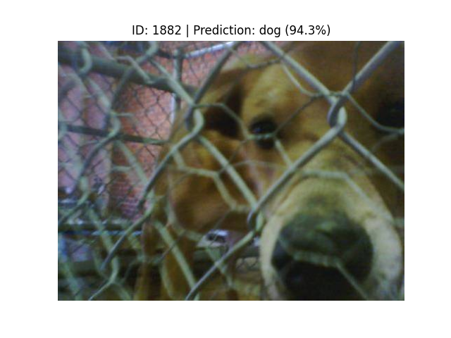
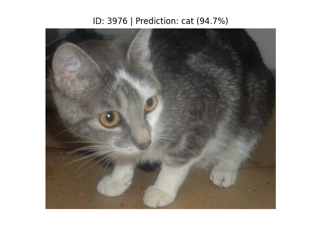
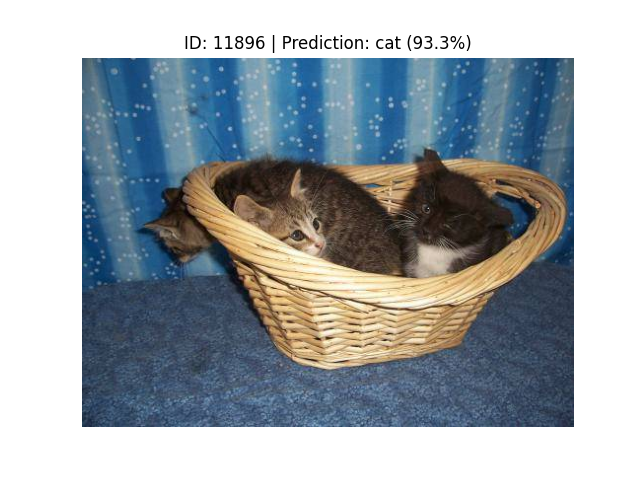
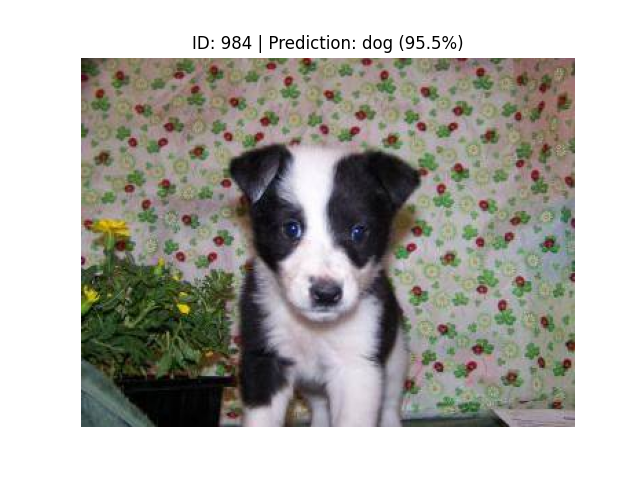
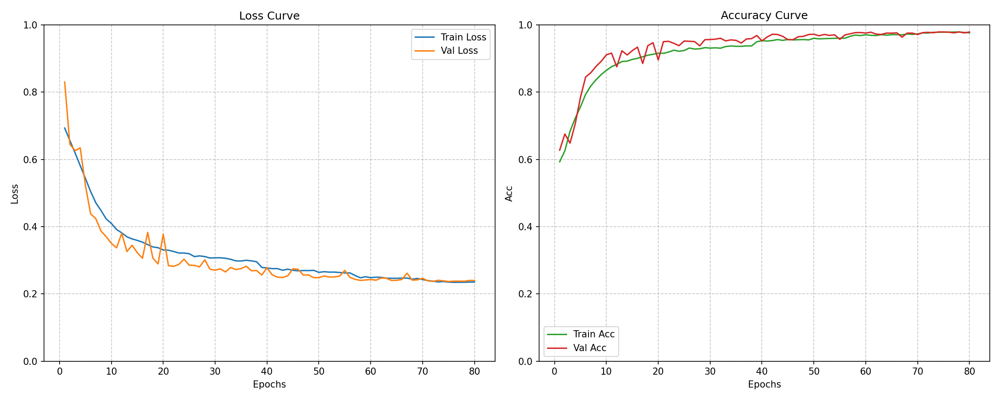
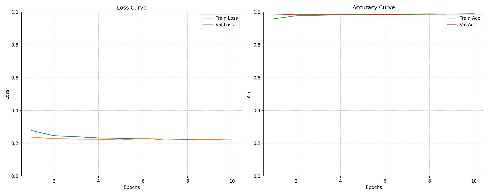
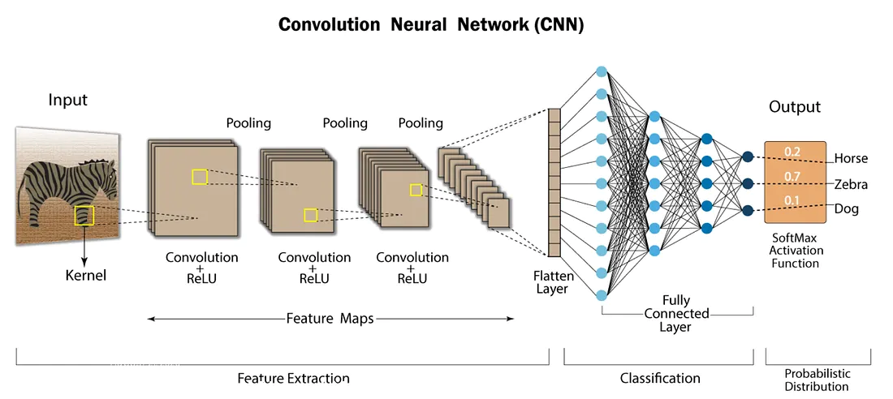
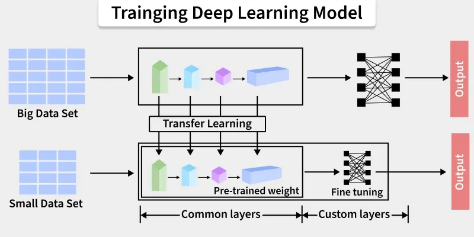

# Dogs vs. Cats

This is a PyTorch implementation of the classic Kaggle competition **"Dogs vs. Cats"** classification based on a **ResNet-18** model. It can achieve 97.90% accuracy on the validation set after training for 80 epochs.  
I'm using `PyTorch 2.10.0+cu128` in `Python 3.12.0`.

#### <em>Update on ```2026/3/10```</em>: 
Implemented **Transfer Learning** by **fine-tuning** a ResNet-18 model pre-trained on ImageNet. It can achieve 98.92% accuracy on the validation set for only 10 epochs.

<br>
<p align="center">
  
</p>

## Structure
```
├── Dogs-vs-Cats/
├── data/
|   ├── raw/
|   |   ├── train
|   |   └── test
|   ├── processed/
|   |   ├── train
|   |   ├── val
|   |   └── test
├── models/
|   ├── best_model.pth
|   ├── latest_checkpoint.pth
|   ├── history.pkl
|   └── ...
├── config.py
├── utils.py
├── prepare_data.py
├── dataset.py
├── model.py
├── train.py
└── predict.py
```

## Requirements
```
matplotlib==3.10.8
numpy==2.4.3
Pillow==12.1.1
torch==2.10.0+cu128
torchvision==0.25.0+cu128
tqdm==4.67.3
```

## Dataset
The dataset comes from Kaggle website: [Dogs vs. Cats](https://www.kaggle.com/competitions/dogs-vs-cats-redux-kernels-edition/data).  
The training set has 25,000 images, half of which are cats and half are dogs. The test set has 12,500 images, which are not labeled as cats or dogs.

## Data Preparation & Augmentation
#### <em>Splitting</em>:  
To split the data, run the command -
```
python prepare_data.py
```
This will split the raw training data into 80% Training and 20% Validation.
#### <em>Augmentation</em>:  
I placed data augmentation in ```dataset.py```
```
data_transforms = {
    'train': transforms.Compose([
        transforms.RandomResizedCrop(IMG_SIZE, scale=(0.5, 1.0)),
        transforms.RandomHorizontalFlip(p=0.5),
        transforms.RandomRotation(degrees=15),
        transforms.ColorJitter(brightness=0.3, contrast=0.3, saturation=0.2, hue=0.03),
        transforms.ToTensor(),
        transforms.Normalize(mean=[0.485, 0.456, 0.406], std=[0.229, 0.224, 0.225]),
        transforms.RandomErasing(p=0.4, scale=(0.02, 0.2), ratio=(0.3, 3.3))
    ]),

    'val': transforms.Compose([
        transforms.Resize(256),
        transforms.CenterCrop(IMG_SIZE),
        transforms.ToTensor(),
        transforms.Normalize(mean=[0.485, 0.456, 0.406], std=[0.229, 0.224, 0.225])
    ])
}
```
It converts images into tensors that model can accept, and improves model's generalization ability by augmenting the training set.  

```RandomResizedCrop(IMG_SIZE, scale=(0.5, 1.0))```: Randomly selects a region (50% - 100%) in the image, and then stretch or shrink it to the specified IMG_SIZE.  
```RandomHorizontalFlip(p=0.5)```: 50% chance of flipping the image horizontally.  
```RandomRotation(degrees=15)```: Rotate the image randomly between -15° and +15°.  
```ColorJitter(brightness=0.3, contrast=0.3, saturation=0.2, hue=0.03)```: Color fluctuation.  
```RandomErasing(p=0.4, scale=(0.02, 0.2), ratio=(0.3, 3.3))```: 40% probability of erasing areas in the image.  

## Model Architecture
The network consists of three main components:
- **Stem**: Initial 7 x 7 convolutional layer and max pooling layer for downsampling and feature extraction.
- **Residual Layers**: Four residual blocks that learn deep features while preserving gradients via skip connections.
- **Classifier**: Average pooling layer and fully connected layers for final prediction.

## Train
To start training, run the command - 
```
python train.py
```
I used ```ReduceLROnPlateau``` to monitor the validation loss. If the validation loss does not decrease within 5 epochs, the learning rate will be reduced by a factor of 0.5.
```
scheduler = ReduceLROnPlateau(
    optimizer,
    mode='min',
    factor=0.5,
    patience=5,
)
```
The file saves the latest model after each epoch as ```latest_checkpoint.pth``` to support resuming training after an interruption. Additionally, it saves the best model based on the validation loss as ```best_model.pth```. Furthermore, the file saves a checkpoint every 10 epochs.

## Test
To test your trained model, run the command -
```
python predict.py
```
It randomly selects an image from the test set, and displays the image and the model's predicition results.

<br>
<p align="center">
  
  
  <br>
  
  
</p>

## Loss Curve
As the picture says, the model can achieve 97.90% accuracy on the validation set after training for 80 epochs. 🐶🐱

<br>
<p align="center">
  
</p>
<br>

Compared to a model trained from scratch, fine-tuning a pre-trained ResNet-18 model achieved an accuracy of 98.92% on the validation set in only 10 epochs.

<br>
<p align="center">
  
</p>
<br>

## A Brief Introduction to CNN
Convolutional Neural Networks (CNNs), also known as ConvNets, are neural network architectures inspired by the human visual system and are widely used in computer vision tasks. They are designed to process structured grid-like data, especially images by capturing spatial relationships between pixels.
- Automatically learn hierarchical features through convolution operations, from simple edges and textures to complex shapes and objects.
- Detect objects at different positions within an image, ensuring robustness to spatial variations.
- Reduce computational complexity by processing local regions instead of the entire image at once.
<br>
<p align="center">
  
  <br>
  <em><strong>Convolutional Neural Networks</strong></em>
</p>

### Key components
1. **Input Layer**: The input layer receives the raw image data and passes it to the network for processing. In CNNs, input is typically a 3D volume (width × height × depth).  
2. **Convolutional Layer**: The Convolutional Layer is responsible for extracting important features from the input data. It applies a set of learnable filters (kernels) that slide over the image and compute the dot product between the filter weights and corresponding image patches, producing feature maps.
3. **Activation Layer**: The Activation Layer introduces non-linearity into the network by applying an element-wise activation function (include ReLU, Tanh, etc.) to the output of the convolution layer. This enables the model to learn complex patterns beyond linear relationships.  
4. **Pooling Layer**: The Pooling Layer is used to reduce the spatial dimensions of the feature maps, making computation faster, reducing memory usage and helping to prevent overfitting. It is typically inserted between convolutional layers in a CNN.  
5. **Flattening**: Flattening converts the multi-dimensional feature maps into a one-dimensional vector after convolution and pooling. This vector is then passed to the fully connected layer for classification or regression.  
6. **Fully Connected Layer**: The fully connected (dense) layer performs high-level reasoning using extracted features and produces the final classification scores.  
7. **Output Layer**: The output layer converts final scores into probabilities using activation functions like Sigmoid (binary classification) or Softmax (multi-class classification).

## What is ResNet?
To overcome the challenges of training very deep neural networks, Residual Networks (ResNet) was introduced, which uses skip connections that allow the model to learn residual mappings instead of direct transformations making deep neural networks easier to train.
- It helps prevent vanishing gradient problems in very deep models.
- Skip connections let information flow directly across layers.
- ResNet enables building networks with hundreds or even thousands of layers.
- It is widely used in computer vision tasks like image classification and object detection.
<br>
<p align="center">
  
  <br>
  <em><strong>Residual Block</strong></em>
</p>

A residual block lets the network skip layers by adding the original input to the processed output, making deep networks easier to train.

## Fine-Tuning
Fine-tuning allows a pre-trained model to adapt to a new task. This approach uses the knowledge gained from training a model on a large dataset and applying it to a smaller, domain-specific dataset. Fine-tuning involves adjusting the weights of the model's layers or updating certain parts of the model to improve its performance on the new task.
<br>
<p align="center">
  
  <br>
  <em><strong>Transfer Learning</strong></em>
</p>

As shown in the image below, fine-tuning consists of the following steps:  
- Pretrain a neural network model, i.e., the source model, on a source dataset (e.g., the ImageNet dataset).  
- Create a new neural network model, i.e., the target model. This copies all model designs and their parameters on the source model except the output layer. We assume that these model parameters contain the knowledge learned from the source dataset and this knowledge will also be applicable to the target dataset. We also assume that the output layer of the source model is closely related to the labels of the source dataset; thus it is not used in the target model.  
- Add an output layer to the target model, whose number of outputs is the number of categories in the target dataset. Then randomly initialize the model parameters of this layer.  
- Train the target model on the target dataset, such as a chair dataset. The output layer will be trained from scratch, while the parameters of all the other layers are fine-tuned based on the parameters of the source model.  
<br>
<p align="center">
  
  <br>
  <em><strong>Fine-Tuning</strong></em>
</p>

When target datasets are much smaller than source datasets, fine-tuning helps to improve models’ generalization ability.  

#### <em>Fine-Tuning in this task</em>:  
The target model copies all model designs with their parameters from the source model except the output layer, and fine-tunes these parameters based on the target dataset. In contrast, the output layer of the target model needs to be trained from scratch.
```
def ResNet18_transfer(num_classes=2):
    weights = models.ResNet18_Weights.IMAGENET1K_V1
    model = models.resnet18(weights=weights)
    in_features = model.fc.in_features
    model.fc = nn.Linear(in_features, num_classes)
    return model
```

I set the base learning rate to a small value in order to fine-tune the model parameters obtained via pretraining. Based on the previous settings, the output layer parameters of the target model will be trained from scratch using a learning rate ten times greater.
```
# config.py
NUM_EPOCHS = 10
LEARNING_RATE = 1e-4


# train.py
model = ResNet18_transfer(num_classes=NUM_CLASSES).to(DEVICE)
    criterion = nn.CrossEntropyLoss(label_smoothing=0.1)
    params_1x = [param for name, param in model.named_parameters()
                 if 'fc' not in name]
    optimizer = optim.Adam([
        {'params': params_1x},
        {'params': model.fc.parameters(), 'lr': LEARNING_RATE * 10}
    ], lr=LEARNING_RATE, weight_decay=1e-4)
```
If you run ```train.py``` while using transfer learning for the first time, it will automatically download the weight file from the internet. Later the program will load directly from the local disk and will no longer require an internet connection.
